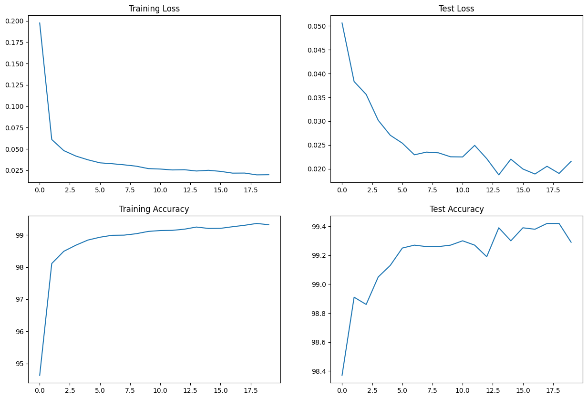
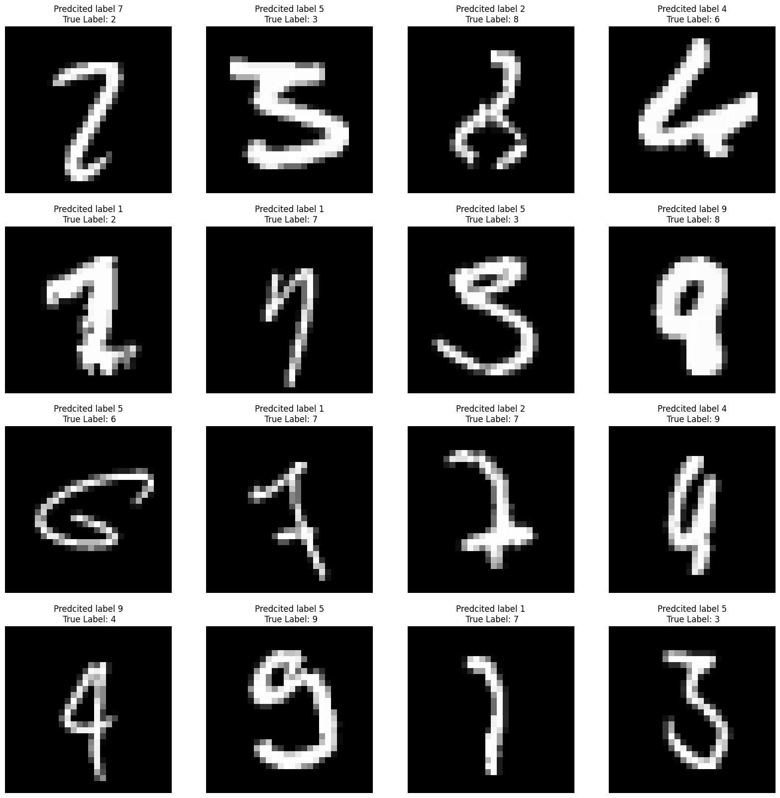
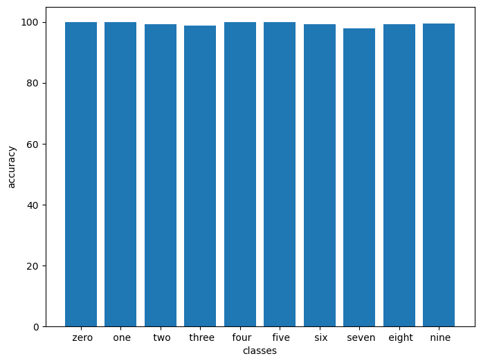

# MNIST Model Training


- [Problem Statement](#Problem-Statement)
- [File Structure](#File-Structure)
- [Model Parameters](#Model-Parameters)
- [Training Logs](#Training-Logs)
- [Results](#Results)
  * [Sample Output](#Sample-Output)
  * [Misclassified Images](#Misclassified-Images)
  * [Accuracy Report for Each class](#Accuracy-Report-for-Each-class)

# Problem Statement
Training a CNN model on MNIST dataset with GitHub Actions integration for automated testing and deployment.

# File Structure
* [model.py](https://github.com/deepanshudashora/MNIST_7824_param/blob/main/model.py) - Contains Model Architecture
* [utils.py](https://github.com/deepanshudashora/MNIST_7824_param/blob/main/utils.py) - Contains training utilities and helper functions
* [tests/](https://github.com/deepanshudashora/MNIST_7824_param/tree/main/tests) - Test files directory
* [images/](https://github.com/deepanshudashora/MNIST_7824_param/tree/main/images) - Generated plots and visualizations
* [.github/workflows/](https://github.com/deepanshudashora/MNIST_7824_param/tree/main/.github/workflows) - GitHub Actions workflow file
* [train.ipynb](https://github.com/deepanshudashora/MNIST_7824_param/blob/main/train.ipynb) - DEMO Training of the model
* [train.py](https://github.com/deepanshudashora/MNIST_7824_param/blob/main/train.py) - Training script for actions

# Model Parameters
```python
----------------------------------------------------------------
        Layer (type)               Output Shape         Param #
================================================================
            Conv2d-1            [-1, 4, 26, 26]              36
              ReLU-2            [-1, 4, 26, 26]               0
       BatchNorm2d-3            [-1, 4, 26, 26]               8
           Dropout-4            [-1, 4, 26, 26]               0
            Conv2d-5           [-1, 10, 24, 24]             360
              ReLU-6           [-1, 10, 24, 24]               0
       BatchNorm2d-7           [-1, 10, 24, 24]              20
           Dropout-8           [-1, 10, 24, 24]               0
         MaxPool2d-9           [-1, 10, 12, 12]               0
           Conv2d-10            [-1, 8, 12, 12]              80
             ReLU-11            [-1, 8, 12, 12]               0
      BatchNorm2d-12            [-1, 8, 12, 12]              16
          Dropout-13            [-1, 8, 12, 12]               0
           Conv2d-14            [-1, 4, 12, 12]              32
             ReLU-15            [-1, 4, 12, 12]               0
      BatchNorm2d-16            [-1, 4, 12, 12]               8
          Dropout-17            [-1, 4, 12, 12]               0
           Conv2d-18           [-1, 10, 10, 10]             360
             ReLU-19           [-1, 10, 10, 10]               0
      BatchNorm2d-20           [-1, 10, 10, 10]              20
          Dropout-21           [-1, 10, 10, 10]               0
           Conv2d-22             [-1, 16, 8, 8]           1,440
             ReLU-23             [-1, 16, 8, 8]               0
      BatchNorm2d-24             [-1, 16, 8, 8]              32
          Dropout-25             [-1, 16, 8, 8]               0
           Conv2d-26             [-1, 18, 6, 6]           2,592
             ReLU-27             [-1, 18, 6, 6]               0
      BatchNorm2d-28             [-1, 18, 6, 6]              36
          Dropout-29             [-1, 18, 6, 6]               0
           Conv2d-30             [-1, 16, 4, 4]           2,592
             ReLU-31             [-1, 16, 4, 4]               0
      BatchNorm2d-32             [-1, 16, 4, 4]              32
          Dropout-33             [-1, 16, 4, 4]               0
        AvgPool2d-34             [-1, 16, 1, 1]               0
           Conv2d-35             [-1, 10, 1, 1]             160
================================================================
Total params: 7,824
Trainable params: 7,824
Non-trainable params: 0
----------------------------------------------------------------
Input size (MB): 0.00
Forward/backward pass size (MB): 0.41
Params size (MB): 0.03
Estimated Total Size (MB): 0.44
----------------------------------------------------------------
```
# Training Logs
```
Epoch 1
Train: Loss=0.0563 Batch_id=937 Accuracy=94.63: 100%|██████████| 938/938 [00:24<00:00, 38.04it/s]
Test set: Average loss: 0.0506, Accuracy: 9837/10000 (98.37%)

Epoch 2
Train: Loss=0.0161 Batch_id=937 Accuracy=98.11: 100%|██████████| 938/938 [00:22<00:00, 41.07it/s]
Test set: Average loss: 0.0383, Accuracy: 9891/10000 (98.91%)

Epoch 3
Train: Loss=0.0476 Batch_id=937 Accuracy=98.49: 100%|██████████| 938/938 [00:22<00:00, 40.79it/s]
Test set: Average loss: 0.0356, Accuracy: 9886/10000 (98.86%)

Epoch 4
Train: Loss=0.0689 Batch_id=937 Accuracy=98.68: 100%|██████████| 938/938 [00:23<00:00, 39.65it/s]
Test set: Average loss: 0.0302, Accuracy: 9905/10000 (99.05%)

Epoch 5
Train: Loss=0.0072 Batch_id=937 Accuracy=98.84: 100%|██████████| 938/938 [00:23<00:00, 40.66it/s]
Test set: Average loss: 0.0270, Accuracy: 9913/10000 (99.13%)

Epoch 6
Train: Loss=0.0488 Batch_id=937 Accuracy=98.93: 100%|██████████| 938/938 [00:23<00:00, 40.74it/s]
Test set: Average loss: 0.0254, Accuracy: 9925/10000 (99.25%)

Epoch 7
Train: Loss=0.1040 Batch_id=937 Accuracy=98.99: 100%|██████████| 938/938 [00:23<00:00, 40.50it/s]
Test set: Average loss: 0.0229, Accuracy: 9927/10000 (99.27%)

Epoch 8
Train: Loss=0.0512 Batch_id=937 Accuracy=98.99: 100%|██████████| 938/938 [00:23<00:00, 40.72it/s]
Test set: Average loss: 0.0235, Accuracy: 9926/10000 (99.26%)

Epoch 9
Train: Loss=0.0530 Batch_id=937 Accuracy=99.04: 100%|██████████| 938/938 [00:22<00:00, 41.14it/s]
Test set: Average loss: 0.0233, Accuracy: 9926/10000 (99.26%)

Epoch 10
Train: Loss=0.0013 Batch_id=937 Accuracy=99.11: 100%|██████████| 938/938 [00:22<00:00, 41.31it/s]
Test set: Average loss: 0.0225, Accuracy: 9927/10000 (99.27%)

Epoch 11
Train: Loss=0.0083 Batch_id=937 Accuracy=99.14: 100%|██████████| 938/938 [00:23<00:00, 40.58it/s]
Test set: Average loss: 0.0225, Accuracy: 9930/10000 (99.30%)

Epoch 12
Train: Loss=0.0019 Batch_id=937 Accuracy=99.14: 100%|██████████| 938/938 [00:23<00:00, 40.76it/s]
Test set: Average loss: 0.0249, Accuracy: 9927/10000 (99.27%)

Epoch 13
Train: Loss=0.0046 Batch_id=937 Accuracy=99.18: 100%|██████████| 938/938 [00:23<00:00, 40.09it/s]
Test set: Average loss: 0.0221, Accuracy: 9919/10000 (99.19%)

Epoch 14
Train: Loss=0.3716 Batch_id=937 Accuracy=99.25: 100%|██████████| 938/938 [00:22<00:00, 40.91it/s]
Test set: Average loss: 0.0187, Accuracy: 9939/10000 (99.39%)

Epoch 15
Train: Loss=0.0102 Batch_id=937 Accuracy=99.20: 100%|██████████| 938/938 [00:22<00:00, 40.96it/s]
Test set: Average loss: 0.0220, Accuracy: 9930/10000 (99.30%)

Epoch 16
Train: Loss=0.0132 Batch_id=937 Accuracy=99.20: 100%|██████████| 938/938 [00:22<00:00, 41.07it/s]
Test set: Average loss: 0.0200, Accuracy: 9939/10000 (99.39%)

Epoch 17
Train: Loss=0.0372 Batch_id=937 Accuracy=99.25: 100%|██████████| 938/938 [00:22<00:00, 41.09it/s]
Test set: Average loss: 0.0189, Accuracy: 9938/10000 (99.38%)

Epoch 18
Train: Loss=0.0088 Batch_id=937 Accuracy=99.30: 100%|██████████| 938/938 [00:22<00:00, 41.21it/s]
Test set: Average loss: 0.0205, Accuracy: 9942/10000 (99.42%)

Epoch 19
Train: Loss=0.0032 Batch_id=937 Accuracy=99.36: 100%|██████████| 938/938 [00:23<00:00, 40.16it/s]
Test set: Average loss: 0.0190, Accuracy: 9942/10000 (99.42%)

Epoch 20
Train: Loss=0.0578 Batch_id=937 Accuracy=99.32: 100%|██████████| 938/938 [00:23<00:00, 39.66it/s]
Test set: Average loss: 0.0216, Accuracy: 9929/10000 (99.29%)

```

# Results

## Accuracy and Loss Curve
<p align="center">
  
</p>


## Misclassified Images
<p align="center">
  
</p>

## Accuracy Report for Each class
<p align="center">
  
</p>

```json
Accuracy of 0 - zero : 100 %
Accuracy of 1 - one : 100 %
Accuracy of 2 - two : 99 %
Accuracy of 3 - three : 98 %
Accuracy of 4 - four : 100 %
Accuracy of 5 - five : 100 %
Accuracy of 6 - six : 99 %
Accuracy of 7 - seven : 97 %
Accuracy of 8 - eight : 99 %
Accuracy of 9 - nine : 99 %
```

## GitHub Actions Details
* use [uv](https://astral.sh/blog/uv) instead of pip for faster installation of dependencies
* run test cases before training the model
* run test cases after training the model

